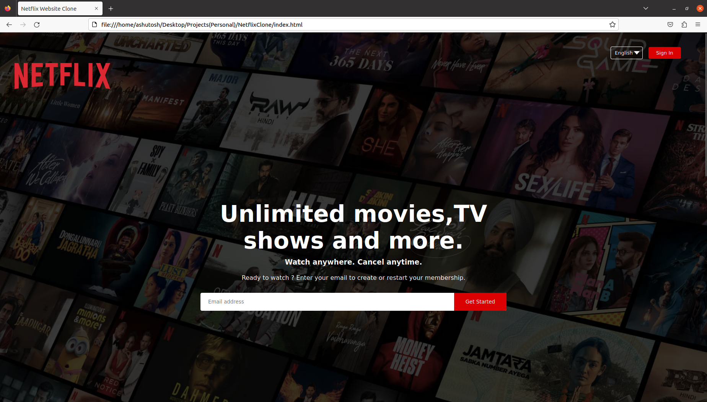
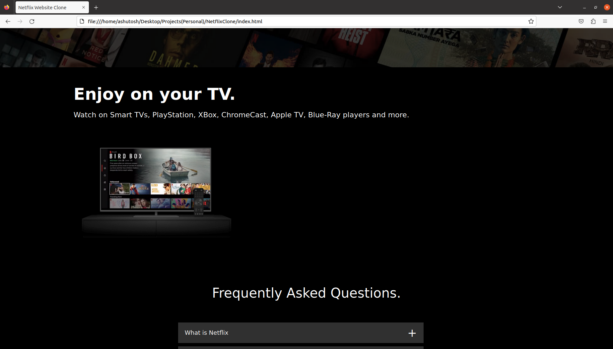
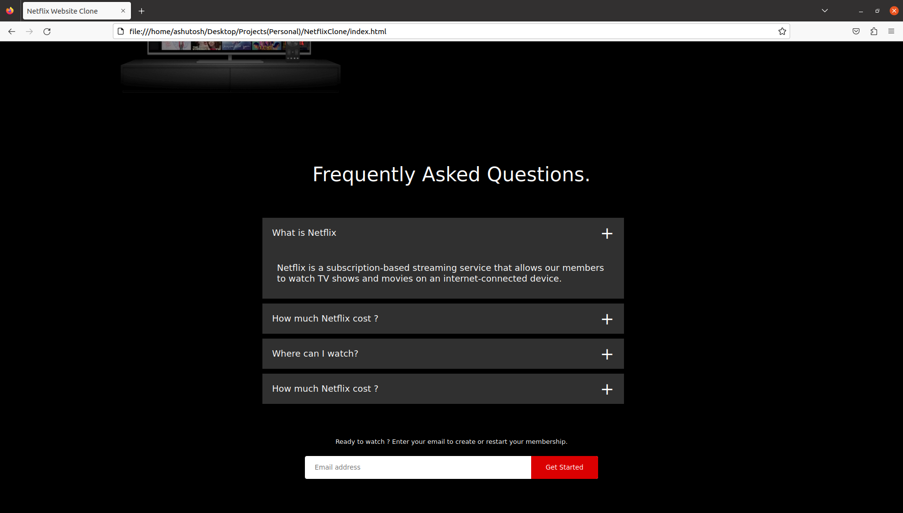

# NetflixClone
The project is a replica of Netflix developed from HTML and CSS

- Programming Languages: Java, HTML, CSS
- Backend: Spring Boot, Node.js
- Testing: JUnit, Jest
- Deployment: Docker
- Version Control: Git
